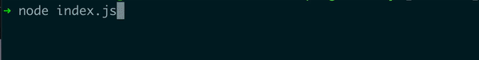

# Ora Progress Bar

A cli progress bar based on ora library.




## Usage

### Create a ProgressBar(title,numberOfSteps,options?)

```javascript
const ProgressBar = require("ora-progress-bar");

const progressBar = new ProgressBar("Current Progress", 100);
```

The options parameter is optional if you want to customize the ora spinner you can pass them [see](https://github.com/sindresorhus/ora#readme).

### Increase the progress using progressBar.progress(progress=1)

```javascript
progressBar.progress();

progressBar.progress(5);
```

### Fail or Succeed

By default when the progressBar reaches its goal, it stops and succeeds. But you can force them to fail or succeed manually.

```javascript
try {
  // do stuff
  progressBar.progress();
} catch (e) {
  progressBar.fail();
}
```

```javascript
if (flag) {
  progressBar.succeed();
} else {
  progressBar.progress();
}
```

### Update goal and current progress on the run

```javascript
if (newWorkReceived) progressBar.updateGoal(progressBar.goal + newWork.length);
```

```javascript
if (batchFailed) progressBar.updateProgress(0);
```

#### Note

Only one progress bar can be active at a time.
